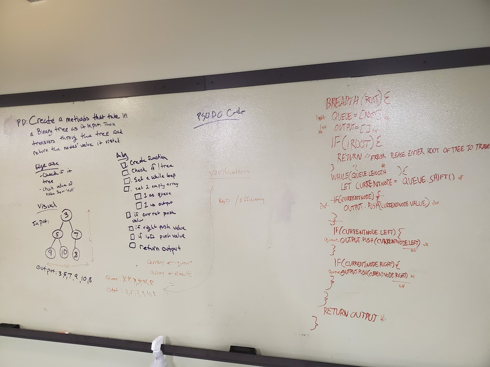

 401n12 Code Challenge 17
===
# Breadth-First Traversal

## Challenge Description
Write a breadth first traversal method which takes a Binary Tree as its unique input. Without utilizing any of the built-in methods available to your language, traverse the input tree using a Breadth-first approach; print every visited node’s value.

## Approach and Efficiency
The Big O is O(n) for time and space.

## Method
breadth is a method on the binaryTree class.

## Solution
